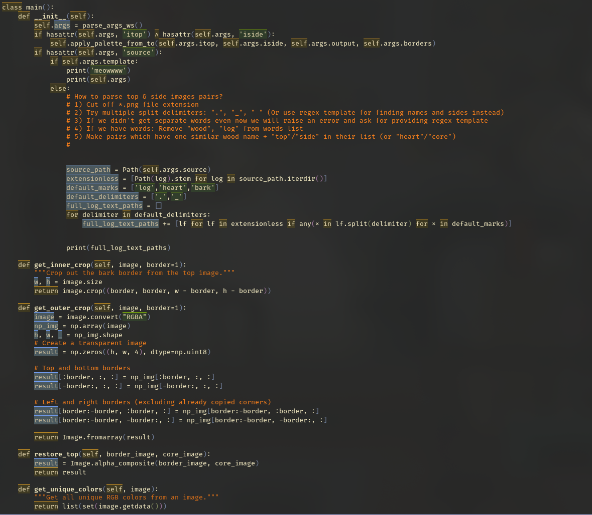

# doom-darkbulge
Original theme link: https://github.com/biletskyy/flatwhite-syntax
Emacs theme. An attempt to port doom-flatwhite to dark gruvbox palette

### Incomplete for now, but at least i can code at night
* Supports nano-modeline

## TODO:
1. Correct color scheme a bit, mb make accent colors brighter
2. Write box highlight for syntax in addition for bg highlight, not this shitty overline